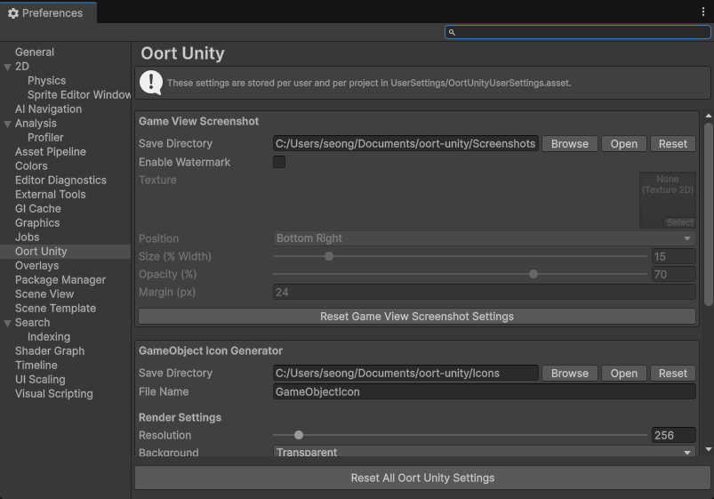
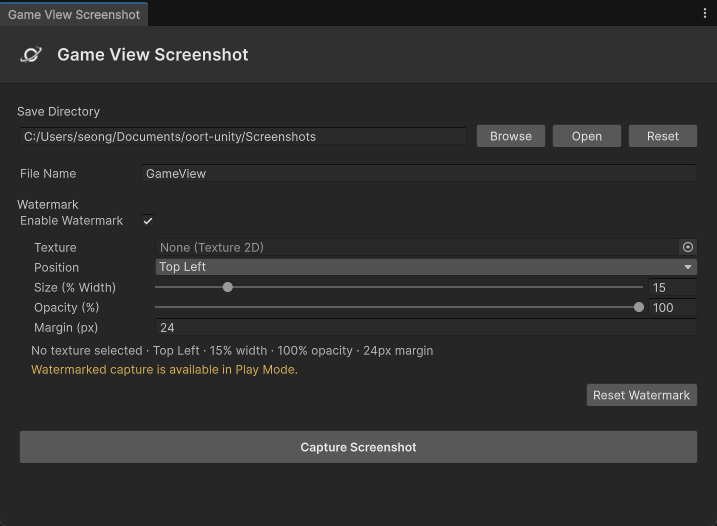
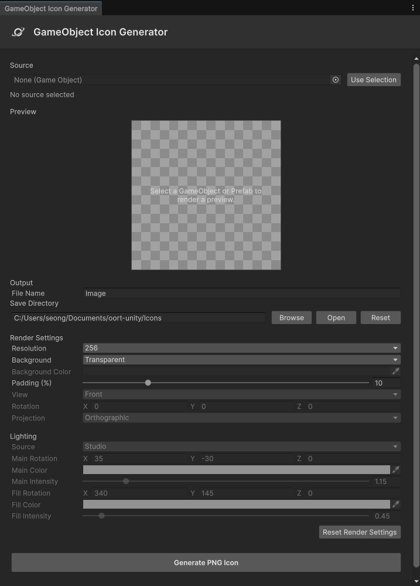
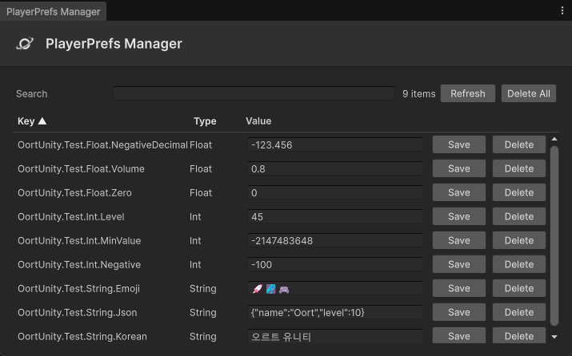

# Oort Unity

Oort Unity is a Unity Package Manager (UPM) package that provides reusable runtime components, editor tools, utilities, and sample content for Unity projects.

## Requirements

- Unity `2022.3` or later
- Git installed and available from the command line

## Installation

### Install via Git URL

Oort Unity can be installed directly through the Unity Package Manager using a Git URL.

1. Open `Window > Package Management > Package Manager`.
2. Click the `+` button in the upper-left corner.
3. Select `Install package from Git URL...`.
4. Enter one of the following URLs.

#### Install the latest version

```text
https://github.com/oort-games/oort-unity.git
```

This installs the latest package version from the `main` branch.

#### Install a specific version

Append a Git tag after `#` to install a specific release.

```text
https://github.com/oort-games/oort-unity.git#v0.0.4
```

Replace `v0.0.1` with the version you want to install.

### Install through manifest.json

You can also add Oort Unity directly to your project's `Packages/manifest.json`.

```json
{
  "dependencies": {
    "com.oortgamestudio.oortunity": "https://github.com/oort-games/oort-unity.git#v0.0.1"
  }
}
```

To use the latest version from the `main` branch, omit the version tag.

```json
{
  "dependencies": {
    "com.oortgamestudio.oortunity": "https://github.com/oort-games/oort-unity.git"
  }
}
```

## Samples

Sample content can be imported through the Unity Package Manager.

1. Open `Window > Package Management > Package Manager`.
2. Select `Oort Unity`.
3. Open the `Samples` section.
4. Click `Import` next to the sample you want to use.

Imported samples are copied to:

```text
Assets/Samples/Oort Unity/<version>/
```

## Editor Tools

### Preferences

Configure Oort Unity editor tool settings from Unity Preferences.

Available settings include:

- Game View Screenshot output directory and watermark options
- GameObject Icon Generator output, render, camera, and lighting options
- Per-tool reset controls
- Global reset with confirmation
- Automatic synchronization with open tool windows

Open Preferences from either location:

```text
Edit > Preferences > Oort Unity
```

```text
Oort > Preferences
```

Settings are stored per user and per project in:

```text
UserSettings/OortUnityUserSettings.asset
```



### Game View Screenshot

Capture the current Game View and save it as a PNG file.

Features include:

- Custom file name and output directory
- Automatic unique file naming
- Direct access to the output directory
- Optional Play Mode watermark
- Configurable watermark position, size, opacity, and margin
- Support for watermark textures with Read/Write disabled

Open the tool from:

```text
Oort > Tools > Game View Screenshot
```



### GameObject Icon Generator

Generate square PNG icons from GameObjects selected in the Hierarchy or Prefabs selected in the Project window.

Features include:

- Automatic 3D and UI object detection
- Transparent-background preview
- Configurable resolution, background, and padding
- Front, back, isometric, and custom views
- Perspective and orthographic projection
- Configurable Studio lighting
- Support for active Scene lights
- Automatic Renderer bounds calculation

Open the tool from:

```text
Oort > Tools > GameObject Icon Generator
```

A sample containing Unlit, URP/Lit, and UI sources is available from the Package Manager.



### PlayerPrefs Manager

Inspect and manage PlayerPrefs stored by the current Unity project.

Features include:

- Search entries by key
- Sort entries by key or value type
- Edit Int, Float, and String values
- Delete individual entries
- Delete all user-created entries after confirmation
- Preserve Unity-generated PlayerPrefs entries

Open the tool from:

```text
Oort > Tools > PlayerPrefs Manager
```

PlayerPrefs key enumeration is currently supported in the Windows Editor.



## Package Structure

```text
com.oortgamestudio.oortunity/
├── Runtime/
├── Editor/
├── Samples~/
├── Documentation~/
├── Tests/
├── package.json
├── CHANGELOG.md
├── LICENSE.md
├── README.md
└── Third Party Notices.md
```

- `Runtime`: Runtime code included in player builds.
- `Editor`: Unity Editor-only tools and extensions.
- `Samples~`: Optional samples available through Package Manager.
- `Documentation~`: Package documentation source files.
- `Tests`: Package tests.

## Documentation

Documentation is available from the `Documentation` link in Unity Package Manager.

## Changelog

See [CHANGELOG.md](./CHANGELOG.md) for version history and release notes.

## License

This project is licensed under the MIT License.

See [LICENSE](./LICENSE.md) for details.

## Author

Oort Games  
Contact: `oortgamestudio@gmail.com`
